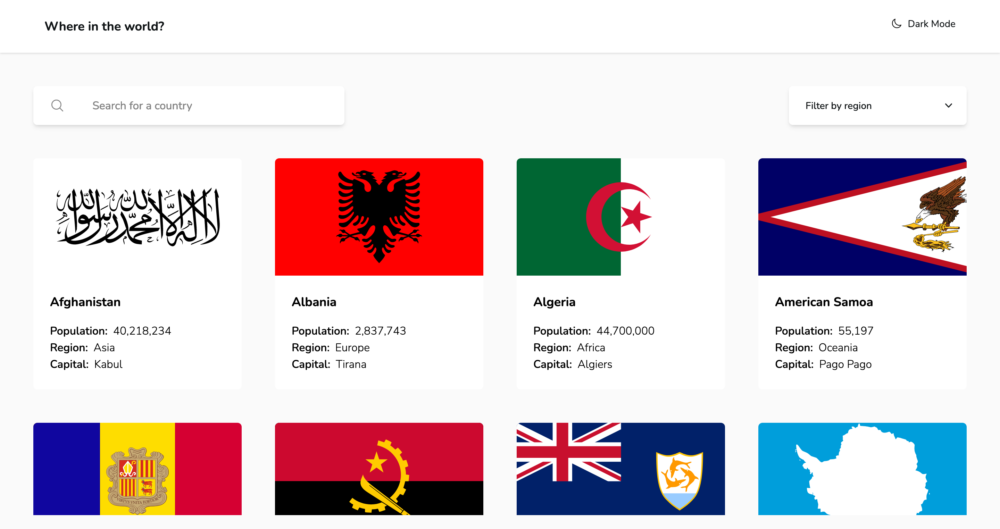

# Frontend Mentor - REST Countries API with color theme switcher solution

This is a solution to
the [REST Countries API with color theme switcher challenge on Frontend Mentor](https://www.frontendmentor.io/challenges/rest-countries-api-with-color-theme-switcher-5cacc469fec04111f7b848ca).
Frontend Mentor challenges help you improve your coding skills by building realistic projects.

## Table of contents

- [Overview](#overview)
    - [Screenshot](#screenshot)
    - [Links](#links)
- [My process](#my-process)
    - [Built with](#built-with)
- [Author](#author)

## Overview

### Screenshot

### Links

- Solution
  URL: [https://github.com/FulbertoDev/QR-Code-Card-Component-with-Tailwind-CSS](https://github.com/FulbertoDev/QR-Code-Card-Component-with-Tailwind-CSS)
- Live Site
  URL: [https://qr-code-card-component-with-tailwind-css.vercel.app/](https://qr-code-card-component-with-tailwind-css.vercel.app/)

## My process

### Built with

- HTML5
- Axios
- [Tailwind CSS](https://tailwindcss.com/)

## Author

- Website - [Fulberto TCHIAKPE](https://www.fulberto.dev)
- Frontend Mentor - [@Gilles-Christ](https://www.frontendmentor.io/profile/Gilles-Christ)
- Twitter - [@Fulberto98](https://www.twitter.com/Fulberto98)